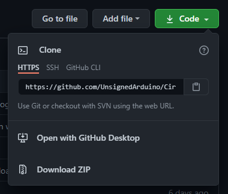
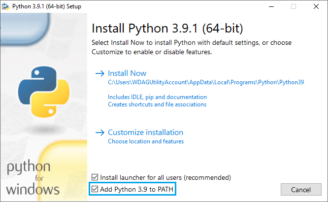
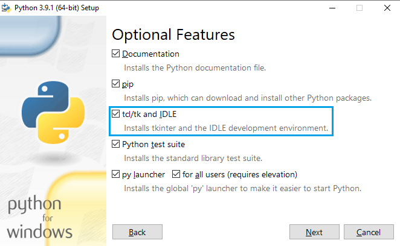
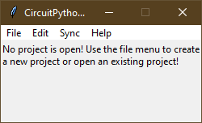
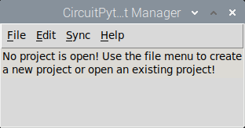
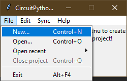
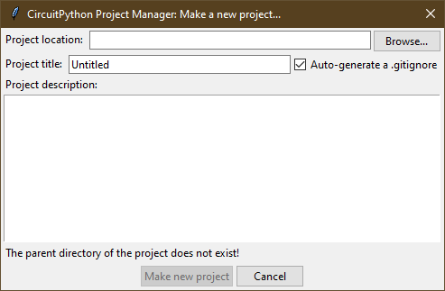

# CircuitPython-Project-Manager
A Python program that will copy files to a CircuitPython device, basically eliminating the risk of losing code from 
the CircuitPython drive being corrupted and allows for version-control systems!

> Problems? Please 
[file an issue](https://github.com/UnsignedArduino/CircuitPython-Project-Manager/issues/new) or even better, a pull 
request if you can fix it!

> Need help/don't understand something? Join the [Adafruit Discord server](http://adafru.it/discord) and ping @Ckyiu 
> on there!

> Note: If you are viewing this file offline, the HTML generated from this markdown isn't perfect. It is highly 
recommended that you view this file on 
[GitHub](https://github.com/UnsignedArduino/CircuitPython-Project-Manager/blob/main/README.md), as it has been tuned for 
GitHub-style markdown.

> Check out my other projects related to CircuitPython: (Oh look **shameless self-promotion** again)
> - [CircuitPython-Bundle-Manager](https://github.com/UnsignedArduino/CircuitPython-Bundle-Manager): A Python program 
    that makes it easy to manage modules on a CircuitPython device!

> Note: As you can tell, the documentation is _definitely_ not finished. While I'm writing this documentation, you 
> can either wait for me to finish (not recommended) or ping me on Discord on the Discord server linked above. 
> (recommended)

## Table of Contents
1. [Installing](#installing)
   1. [Installing from source](#installing-from-source)
2. [Running](#running)
3. [How to use](#how-to-use)
   1. [First run](#first-run)
   2. [Making a new project](#making-a-project)
   3. [Managing projects](#managing-projects)
   4. [Managing dependencies](#managing-dependencies)
   5. [The menu-bar in depth](#the-menu-bar-in-depth)
4. [Options](#options)

## Installing

Due to how new this project is, there are no binaries currently.  

### Installing from source

1. [Download](https://git-scm.com/downloads) and install Git. It does not matter what editor you use for Git's default.
    1. Or...download this repo via the `Download ZIP` option under the green `Code` button, shown in Figure 1.1:
    
    
    
2. [Download](https://www.python.org/downloads/) and install Python **3.9**. (Because I use type definitions, but 3.8 
   seems to work too)
    1. Make sure to check `Add Python 3.x to PATH`, as shown in Figure 1.2:
       
       
       
    2. Make sure to also install Tk/Tcl support! If you can access the IDLE, then Tk/Tcl is installed, as shown in 
       Figure 1.3: (Only applies if you are using the `Customize installation` option in the installer)
       
       
   
       If you are building Python,
       [here is a guide on building Python on Debian I found helpful](https://linuxize.com/post/how-to-install-python-3-8-on-debian-10/).
       Before building, you may need to install a bunch of packages using `apt`: 
       `sudo apt install libbz2-dev libgdbm-dev libgdbm-compat-dev liblzma-dev libsqlite3-dev libssl-dev uuid-dev libreadline-dev zlib1g-dev tk-dev libffi-dev`.
       
3. If you are on Windows, I would also install the 
   [Windows Terminal](https://www.microsoft.com/en-us/p/windows-terminal/9n0dx20hk701) while you are at it.

4. If you installed Git, `cd` into a convenient directory (like the home directory or the desktop) and run:
    ```commandline
    git clone https://github.com/UnsignedArduino/CircuitPython-Project-Manager
    cd CircuitPython-Project-Manager
    ```
    1. If you downloaded the ZIP, move the downloaded ZIP to somewhere convenient (ex. home directory or desktop), 
       extract it, open a terminal and `cd` into the extracted directory.

5. If you run `dir` (or `ls -a` on Mac and Linux) you should get something like this:

    1. `dir` (Windows):
    
    ```commandline
    03/31/2021  04:49 PM    <DIR>          .
    03/31/2021  04:49 PM    <DIR>          ..
    03/31/2021  04:49 PM                33 .gitignore
    03/31/2021  04:49 PM    <DIR>          assets
    03/31/2021  04:49 PM    <DIR>          default_circuitpython_hierarchy
    03/31/2021  04:49 PM            59,538 gui.py
    03/31/2021  04:49 PM    <DIR>          gui_tools
    03/31/2021  04:49 PM               934 main.py
    03/31/2021  04:49 PM    <DIR>          project_tools
    03/31/2021  04:49 PM             3,674 README.md
    03/31/2021  04:49 PM                38 requirements.txt
    5 File(s)         64,217 bytes
    6 Dir(s)  39,622,823,936 bytes free
    ```

   2. `ls -a` (macOS and Linux):
    
    ```commandline
    .  ..  assets  default_circuitpython_hierarchy  .git  .gitignore  gui.py  gui_tools  main.py  project_tools  README.md  requirements.txt
    ```

6. If you are going to use a [virtual environment](https://docs.python.org/3/library/venv.html), run the following 
   commands:
    1. Windows:
    ```commandline
    python -m venv .venv
    ".venv/Scripts/activate.bat"
    ```
    2. macOS and Linux:
    ```commandline
    python3 -m venv .venv
    source .venv/bin/activate
    ```

7. Install the packages:
    1. Windows:
    ```commandline
    pip install -r requirements.txt
    ```
    2. macOS and Linux:
    ```commandline
    pip3 install -r requirements.txt
    ```

8. You should now be able to run it!
    1. Windows:
    ```commandline
    python main.py
    ```
    2. macOS and Linux:
    ```commandline
    python3 main.py
    ```

[Back to table of contents](#table-of-contents)

## Running
~~If you installed from a binary, then just run the `CircuitPython Project Manager.exe` (`CircuitPython Project Manager` 
macOS and Linux) file. You may want to create a shortcut/symlink to it on the desktop or create a menu entry. If you 
would like to submit an icon, you can open an issue for it with the icon.~~ No binaries just yet! 

If you install from source and you are not using a virtual environment, then you can just create a `.bat` file containing 
`python \path\to\the\main.py` (`python3`, forward slashes, and use `.sh` for the extension on macOS and Linux) on the 
desktop for convenience. Otherwise, you will need to re-activate the virtual environment everytime you want to run it. 
I highly recommend using these shell scripts:

1. Windows:

```batch
:: Replace this with the path to the directory of the CircuitPython Project Manager, should have main.py in it
cd path\to\the\CircuitPython-Project-Manager
:: You can use python.exe or pythonw.exe - the w one will just supress output of the program
".venv\Scripts\pythonw.exe" main.py
```

2. macOS and Linux:

```shell
# Replace with the path to the CircuitPython Project Manager
cd path/to/the/CircuitPython-Project-Manager
.venv/bin/python3 main.py
```
Don't forget to give the `.sh` file execute permission! (`chmod +x shell_file.sh`)

[Back to table of contents](#table-of-contents)

## How to use

### First run
On run, you should get something like this:

> If the GUI looks different from these images, it's because I don't want to update all these images. I will only 
> update the relevant images.

Figure 2.1: Start up on Windows.



Figure 2.2: Start up on Debian. (To be honest, Tk doesn't look that _great_ on Linux...)



> Note: From now on, I will be exclusively showing pictures of the CircuitPython Project Manager on Windows unless there 
> are Linux-specific instructions. The interface is _exactly_ the same.

First, let's make a project...

[Back to table of contents](#table-of-contents)

### Making a project

First, lets go to the file menu and click `New...`. As the accelerators say (yea that's the technical term - it's 
supposed to "accelerate" the usage of the program) you can also press <kbd>Ctrl</kbd> + <kbd>N</kbd>. 
(<kbd>Cmd</kbd> - <kbd>N</kbd> for macOS)

Figure 2.3: The file menu with `New...` command highlighted. 



A new dialog should pop up on your screen - you won't miss it as it's bigger than the main window!

Figure 2.4: The New project dialog.



Click the `Browse...` button to select a directory to place the project in. Or you can also type/copy and paste in the 
location of the project.

Then you may want to change the title of the project to something other than "Untitled."

If you plan on using Git as a VCS, there is a checkbutton on whether you want to auto-generate a `.gitignore`. Really
it might be better to make it mandatory because you should always use a VCS for your code. If you never heard of a VCS 
or Git, then just uncheck this option. 

If you want, type in a description for this project. It's not mandatory at all but it's nice to put TODOs in there or 
whatever. 

If it satisfies the requirements than you can press the `Make new project` button. Otherwise the status message will 
tell you why you can't make a new project with the current settings. 

Once you make a new project, it will open automatically in the main window. On to the next section!

[Back to table of contents](#table-of-contents)

### Managing projects

Nothing here just yet!

[Back to table of contents](#table-of-contents)

### Managing dependencies

Nothing here just yet!

[Back to table of contents](#table-of-contents)

### The menu-bar in depth

Nothing here just yet!

[Back to table of contents](#table-of-contents)

## Options

You can find these options in `config.json`, which is in the same directory as 
[`main.py`](https://github.com/UnsignedArduino/CircuitPython-Project-Manager/blob/main/main.py), and should be 
auto-generated upon first run. In case it does not happen, (file a issue?) this is the default JSON file:
```json
{
    "last_dir_opened": "E:\\Test",
    "opened_recent": [
        "E:\\Test\\Untitled\\.cpypmconfig"
    ],
    "show_traceback_in_error_messages": false,
    "unix_drive_mount_point": "/media"
}
```
- `last_dir_opened` should be a string of a path that points to the last directory that you opened, so the next time 
  you open a file/directory, you will start there! It will be set once you open a directory/file, and **will not appear 
  immediately.** 
- `opened_recent` should be a list of strings which are the paths of projects you last opened. It will be set once you 
  open/create a new project, and **will not appear immediately.** 
- `show_traceback_in_error_messages` should be a boolean. (Either `true` or `false`) This will control whether stack 
  traces will appear in error messages.
- `unix_drive_mount_point` should be a string of a path that points to the place where your distro automatically mounts 
  drives. Only applies to Unix-based systems.

[Back to table of contents](#table-of-contents)